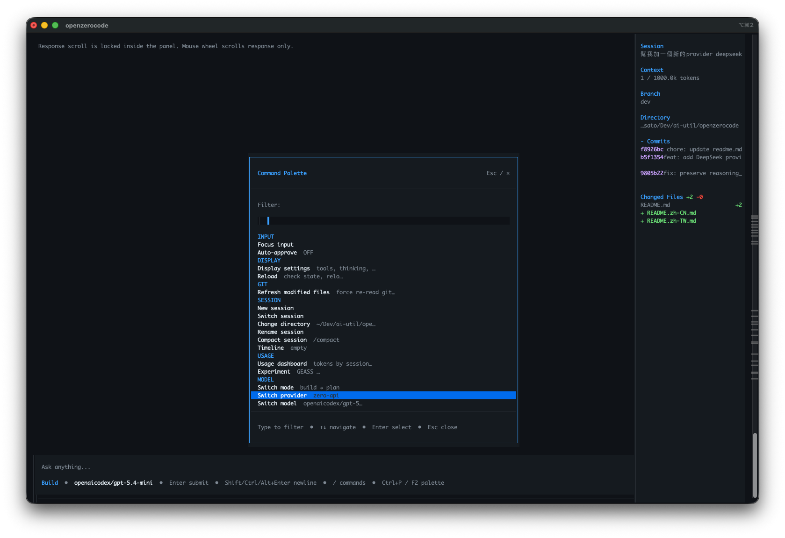
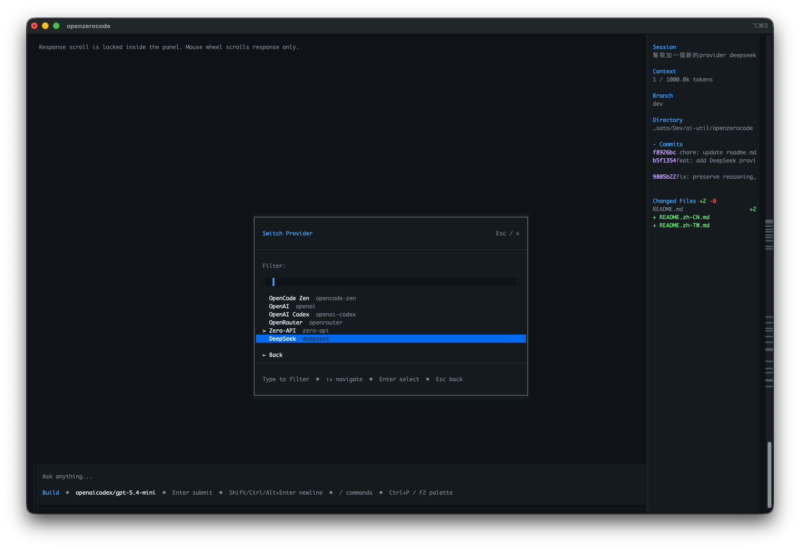
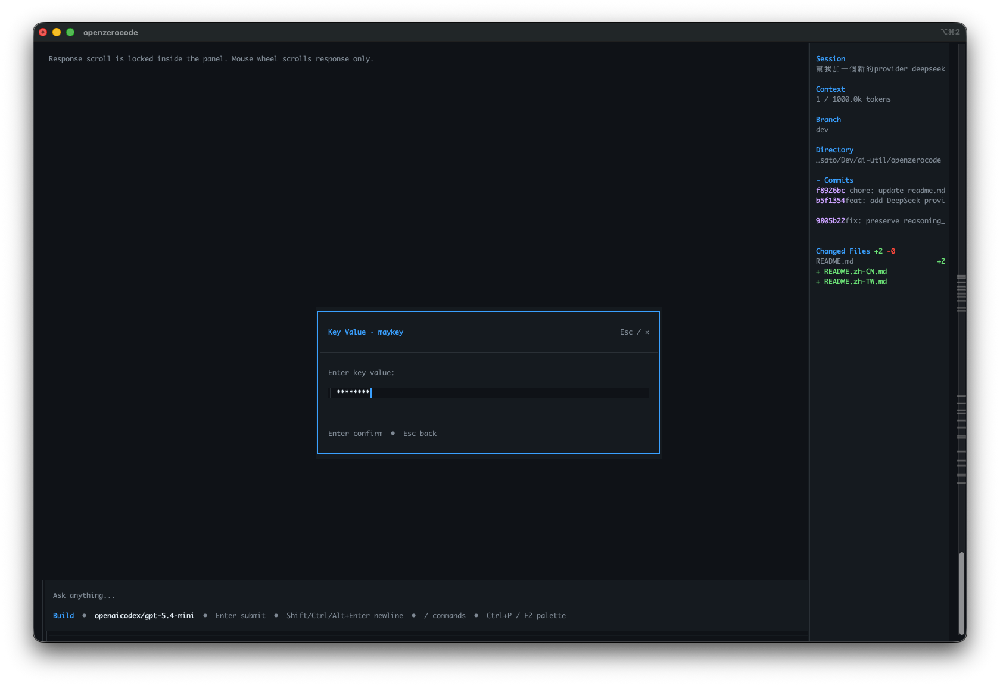
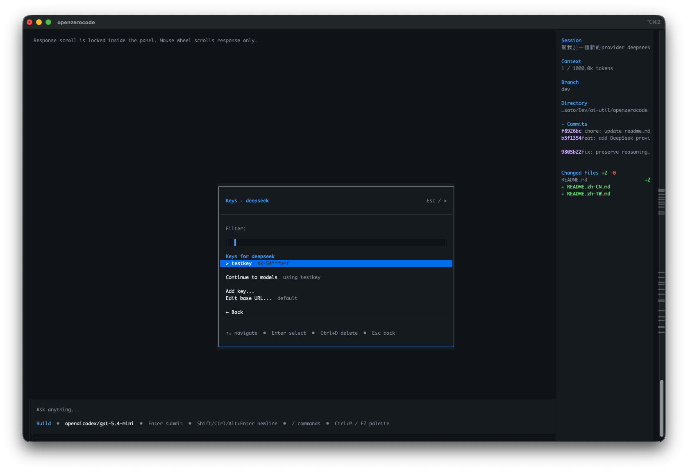
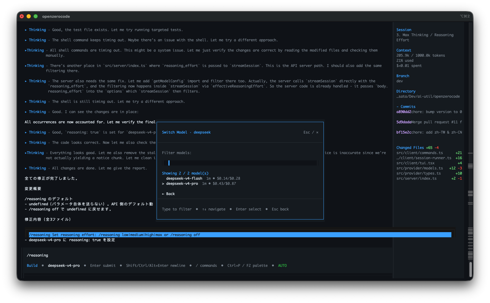
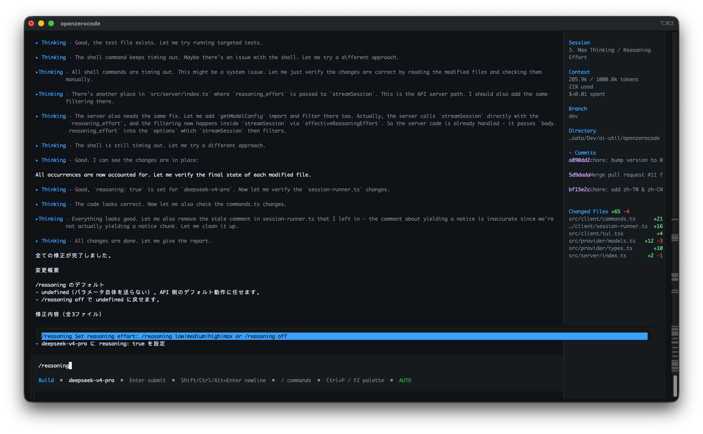
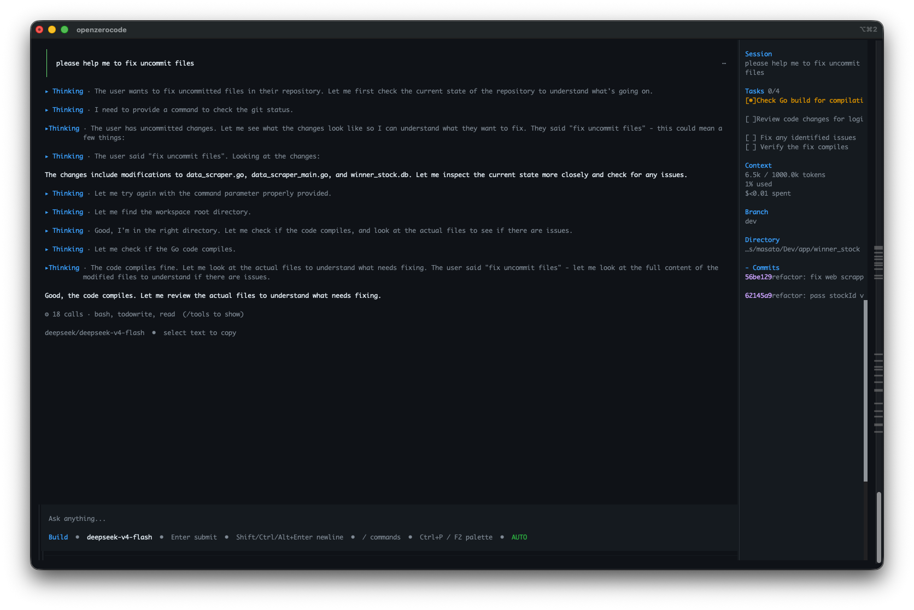

[English](./openzerocode.md) | [简体中文](./openzerocode.zh-CN.md) · [← 返回](../README.zh-CN.md)

# 接入 OpenZeroCode

OpenZeroCode 是一个本地优先的终端 AI 编程代理，灵感来自 OpenCode。它提供 TUI 交互体验，内置工具、会话持久化、Provider 切换、模型切换和工作区记忆。

- **GitHub：** <https://github.com/arborlogic/openzerocode>

#### 1. 安装 OpenZeroCode

- 安装 [Bun](https://bun.sh/docs/installation) 1.2+，并确保 `npm` 可在 `PATH` 中使用。
- 通过 npm 安装 OpenZeroCode：

```sh
npm install -g openzerocode
```

- 验证安装：

```sh
openzerocode --version
```

也可以从源码安装：

```sh
git clone https://github.com/arborlogic/openzerocode.git
cd openzerocode
python3 scripts/dev-install.py
```

#### 2. 启动 OpenZeroCode

进入你的项目目录并运行：

```sh
cd /path/to/my-project
openzerocode
```

使用 `Ctrl+P` 或 `F2` 打开命令面板，然后选择 **Switch provider**。

<div align="center">

</div>

#### 3. 选择 DeepSeek Provider

在 Provider 选择器中选择 **DeepSeek**。

<div align="center">

</div>

#### 4. 添加或选择 DeepSeek API Key

OpenZeroCode 会将 Provider 凭证保存在本地。进入 DeepSeek key 面板后，你可以选择已有 key、继续使用当前 key、添加新 key，或编辑 base URL。

如需添加新 key，选择 **Add key...**。

<div align="center">

</div>

输入你的 [DeepSeek API Key](https://platform.deepseek.com/api_keys)，然后确认。

#### 5. 选择 DeepSeek 模型

完成 key 配置后，选择 DeepSeek 模型。OpenZeroCode 支持 DeepSeek V4 Flash 和 DeepSeek V4 Pro。

OpenZeroCode 会为 DeepSeek V4 模型配置 100 万 token 上下文窗口。

<div align="center">

</div>

<div align="center">

</div>

<div align="center">

</div>

#### 6. 开始使用 DeepSeek 编程

Provider 和模型选择完成后，当前模型会显示在输入栏中。输入需求并按 `Enter` 发送。

<div align="center">

</div>

#### 常用命令

| 命令 | 说明 |
|------|------|
| `Ctrl+P` / `F2` | 打开命令面板 |
| `/provider-key list deepseek` | 列出已保存的 DeepSeek keys |
| `/provider-key use deepseek <key-name>` | 切换到已保存的 DeepSeek key |
| `/provider-key path` | 查看本地 Provider 配置文件路径 |
| `--provider deepseek` | 启动时指定 DeepSeek 作为 Provider |
| `--model <name>` | 启动时指定模型 |
